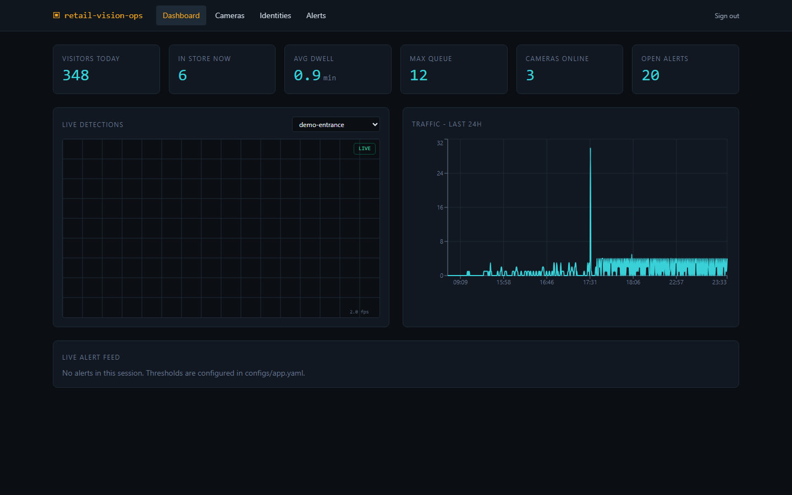
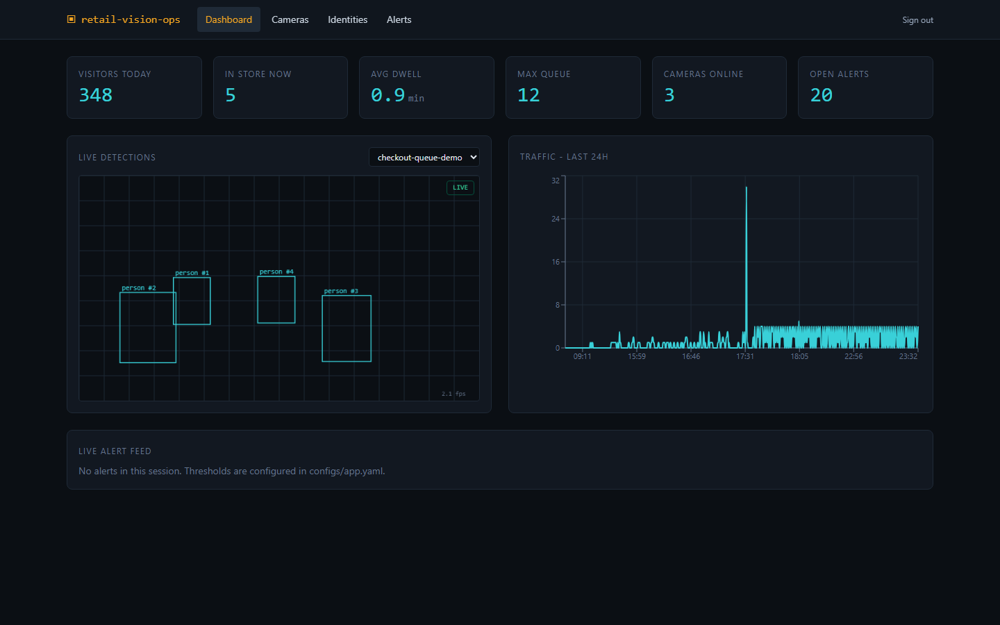
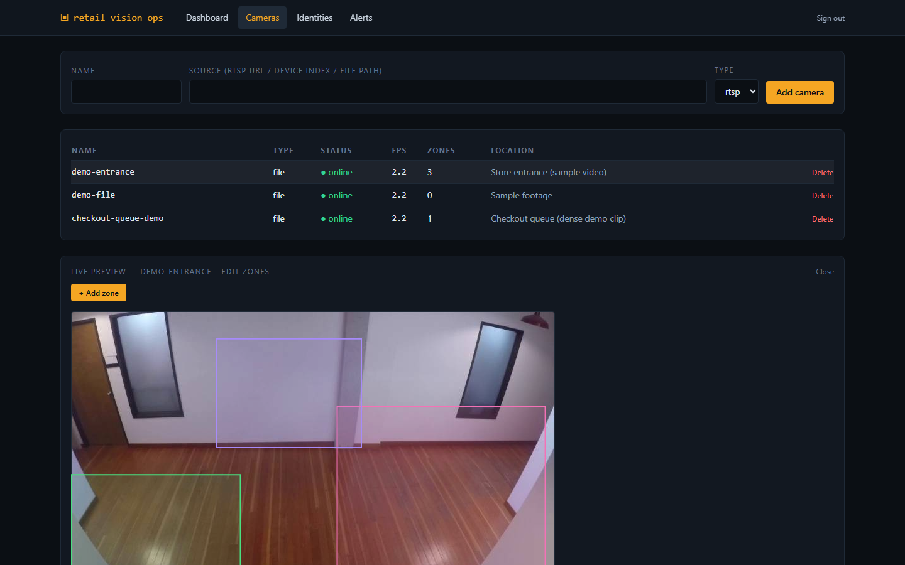
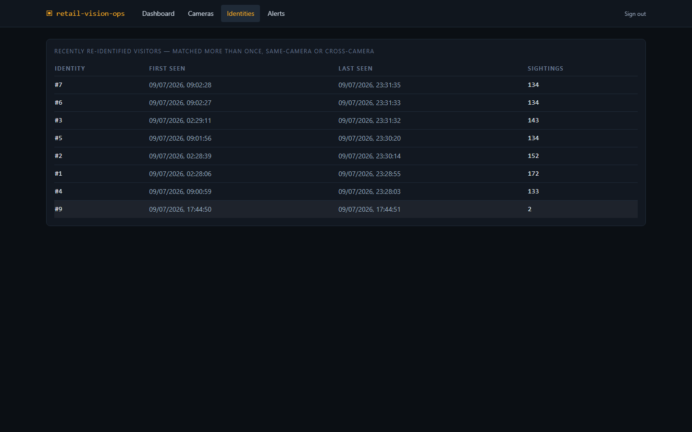
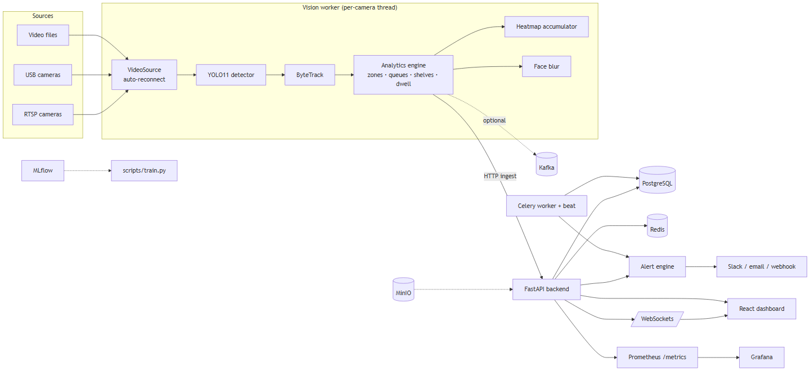

# Smart Multi-Camera Retail Analytics System

**Real-time multi-camera retail analytics** — YOLO11 detection, ByteTrack tracking, and
cross-camera-ready person re-identification, built full-stack (FastAPI + React),
Dockerized, and CI-verified end-to-end.

[](https://github.com/Anurag-YadavIIH/multicam-retail-analytics/actions/workflows/ci.yml)

**Stack:** Python 3.12 · FastAPI · SQLAlchemy 2 · PostgreSQL · Redis · Celery · Kafka ·
Ultralytics YOLO11 · ByteTrack (supervision) · ONNX Runtime · React + TypeScript + Vite +
Tailwind + Recharts · MinIO · MLflow · DVC · Prometheus · Grafana · GitHub Actions

## Demo

> 🎬 **[GIF placeholder — 10-15s clip of the dashboard updating live as detections stream in]**

<table>
<tr>
<td width="50%">

<em>Live KPIs, traffic trend, and alert feed.</em>
</td>
<td width="50%">

<em>YOLO11 + ByteTrack boxes and track IDs on the live feed.</em>
</td>
</tr>
<tr>
<td width="50%">

<em>Draw a queue/entrance/aisle polygon over the camera snapshot — no code, no restart.</em>
</td>
<td width="50%">

<em>Re-identified visitors and their tracked journey across sightings.</em>
</td>
</tr>
</table>


<em>Cameras → vision worker (YOLO11 + ByteTrack + Re-ID) → FastAPI → PostgreSQL/Redis → React dashboard.</em>

## Key features

- **Real-time detection & tracking** — YOLO11 + ByteTrack, persistent IDs, trajectory/speed, automatic lost-track recovery
- **Zone/queue/shelf analytics** — dwell time, occupancy, loitering, restricted-zone violations, computed live from tracked frames
- **Cross-camera-ready person Re-ID** (OSNet + ONNX Runtime) — live-validated against a continuously running stack: one identity correctly re-matched 36 times, two others 18 and 9 times, zero false merges across all 4 identities over several hours. Same-camera re-identification demonstrated; cross-camera architecture is ready but not yet exercised on multi-camera footage — see [docs/REID.md](docs/REID.md)
- **Real-time alerting** — Slack / email / webhook dispatch with 5-minute dedup
- **Privacy by default** — faces blurred on-worker before a frame ever leaves the camera process
- **Full ops UI** — live MJPEG preview, in-browser zone editor, WebSocket-driven live dashboard
- **Runs on a laptop** — 8 GB RAM "lite" Docker Compose profile; a full profile (Kafka, MinIO, MLflow, Prometheus, Grafana) is architected for scaled deployments

## Architecture

Clean Architecture layering: domain logic (the analytics engine, tracking) has zero
framework dependencies; FastAPI, the vision worker, and Kafka are adapters at the edges,
not the core. Each camera runs its own vision-worker thread — YOLO11 → ByteTrack →
zone/queue analytics → Re-ID embedding — and pushes results to a FastAPI backend over
HTTP, which fans out to PostgreSQL, Redis, WebSockets, and the alert engine. Full design
(sequence diagrams, ER diagram, SOLID notes): [docs/ARCHITECTURE.md](docs/ARCHITECTURE.md).


## Quick start (8 GB RAM — verified)

Requirements: Docker Desktop, ~6 GB free RAM, ~8 GB disk.

```bash
cp .env.example .env
python scripts/download_sample_video.py        # fetches a retail demo clip
docker compose up -d --build postgres redis backend vision-worker frontend
```

| URL | What | Login |
|---|---|---|
| http://localhost:5173 | Ops dashboard | admin@retail.local / admin12345 |
| http://localhost:8000/docs | Swagger / OpenAPI | JWT via /auth/login |

The seeded `demo-entrance` camera plays the sample video on loop; within a minute you'll
see live detections streaming on the dashboard, traffic charts filling in, and Re-ID
matches accumulating.

Full profile (Kafka, MinIO, MLflow, Prometheus, Grafana, Celery — ~12 GB RAM):
[docs/DEPLOYMENT.md](docs/DEPLOYMENT.md).

## What's proven vs. what's designed

Scoped deliberately, not left unfinished:

**Run and verified live:** the lite profile above (Postgres/Redis/backend/vision-worker/
frontend); the full test suite, lint, Docker build, and Trivy scan on every push; every
script in `scripts/`, run exactly as documented; and the Re-ID matcher, calibrated then
validated for hours against a live, continuously running stack — see
[docs/REID.md](docs/REID.md).

**Architected, not verified on this hardware:** Kafka fan-out for the Re-ID matcher (the
matcher function is transport-agnostic by design specifically so this drops in later
without changing matching logic), the full observability profile (Kafka/MinIO/MLflow/
Prometheus/Grafana/Celery), and the GPU/TensorRT inference path. Nothing ships here
without being run for real first — see [TASKS.md](TASKS.md) for what's next and why each
is scoped out rather than shipped unverified.

## Tech stack

Python 3.12 · FastAPI · SQLAlchemy 2 · PostgreSQL · Redis · Celery · Kafka ·
Ultralytics YOLO11 · ByteTrack (supervision) · ONNX Runtime · React + TypeScript + Vite +
Tailwind + Recharts · MinIO · MLflow · DVC · Prometheus · Grafana · GitHub Actions

**Engineering practices:** 144 tests, 91% coverage on backend/analytics/tracking/vision,
enforced in CI alongside ruff/black; CI's Trivy scan caught a real critical `torch.load`
RCE (CVE-2025-32434) before it shipped; embeddable video/WebSocket auth uses ~60s
camera-scoped tokens instead of the full access token, so a leaked dashboard URL can't
grant broader API access.

Docs: [Architecture](docs/ARCHITECTURE.md) · [API](docs/API.md) ·
[Deployment](docs/DEPLOYMENT.md) · [Training](docs/TRAINING.md) ·
[Inference](docs/INFERENCE.md) · [Re-ID design](docs/REID.md) ·
[Developer guide](docs/DEVELOPER_GUIDE.md) · [Contributing](docs/CONTRIBUTING.md)

## License

MIT — see [LICENSE](LICENSE).
