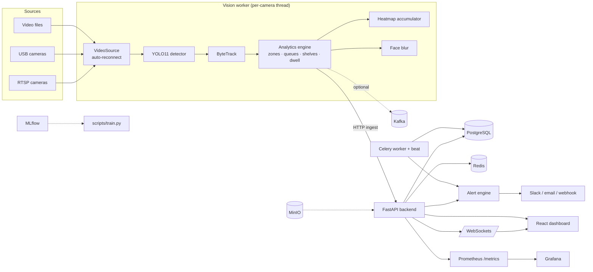
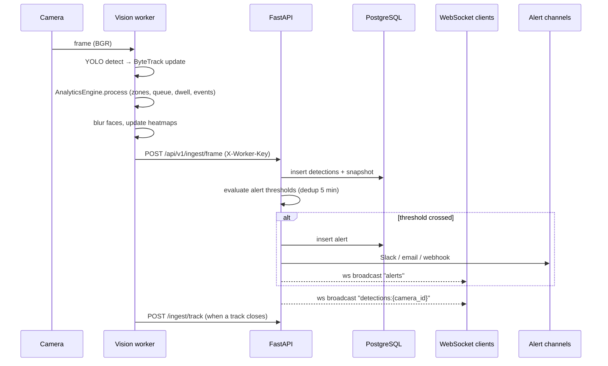
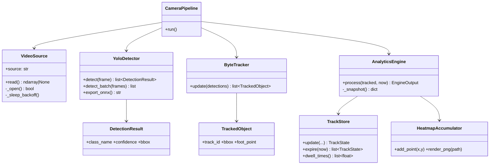
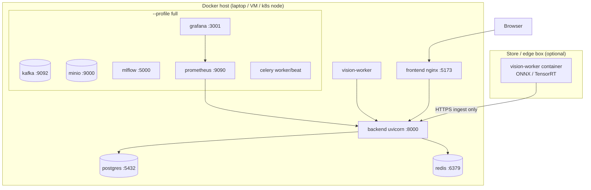

# Architecture

Clean Architecture layering: domain logic (`analytics/`, `tracking/`) has zero framework
dependencies; adapters (`vision/`, `streaming/`, `backend/app/api`) sit at the edges;
FastAPI is the delivery mechanism, not the core. SOLID notes at the bottom.

## System diagram



## Sequence: one frame through the pipeline



## ER diagram

```mermaid
erDiagram
    USERS ||--o{ AUDIT_LOGS : performs
    CAMERAS ||--o{ ZONES : has
    CAMERAS ||--o{ FRAMES : produces
    CAMERAS ||--o{ DETECTIONS : produces
    CAMERAS ||--o{ TRACKS : produces
    CAMERAS ||--o{ EVENTS : produces
    CAMERAS ||--o{ ALERTS : triggers
    CAMERAS ||--o{ ANALYTICS_SNAPSHOTS : aggregates
    CAMERAS ||--o{ REPORTS : summarizes
    ZONES ||--o{ EVENTS : located_in

    USERS { int id PK, string email UK, string hashed_password, enum role, bool is_active }
    CAMERAS { int id PK, string name UK, string source, enum type, enum status, float measured_fps, datetime last_heartbeat }
    ZONES { int id PK, int camera_id FK, string name, enum type, json polygon }
    DETECTIONS { int id PK, int camera_id FK, datetime ts, string class_name, float confidence, float x1y1x2y2, int track_id }
    TRACKS { int id PK, int camera_id FK, int track_id, datetime first_seen, datetime last_seen, float duration_s, float avg_speed_px_s, json trajectory, json zones_visited }
    EVENTS { int id PK, int camera_id FK, int zone_id FK, enum type, int track_id, json payload }
    ALERTS { int id PK, int camera_id FK, enum type, enum severity, text message, bool acknowledged }
    ANALYTICS_SNAPSHOTS { int id PK, int camera_id FK, datetime ts, int people_count, int unique_visitors, float avg_dwell_s, int queue_length, json zone_occupancy }
    REPORTS { int id PK, string kind, int camera_id FK, json summary, string object_key }
    AUDIT_LOGS { int id PK, int user_id FK, string action, string resource, json detail }
    FRAMES { int id PK, int camera_id FK, datetime ts, string object_key }
```

## UML: vision pipeline classes



## Deployment diagram



## Design decisions

- **Single writer:** vision workers never touch the DB; they POST to `/ingest/*`. Keeps
  alert evaluation, WebSocket fan-out and metrics in one consistent place, and lets edge
  workers run with outbound HTTP only.
- **Normalized coordinates** everywhere past the detector, so zone polygons survive
  resolution changes.
- **CPU-first defaults** (yolo11n @ 5 FPS, 960 px) with GPU as a config flip
  (`DEVICE=cuda:0`, uncomment `gpus: all`).
- **SOLID:** detector/tracker behind small interfaces (swap YOLO↔ONNX, ByteTrack↔BoT-SORT
  without touching analytics); `AnalyticsEngine` depends on abstractions
  (`ZoneDef`, `TrackedObject`), not on FastAPI or torch; RBAC via a composable
  `RoleChecker` dependency.
